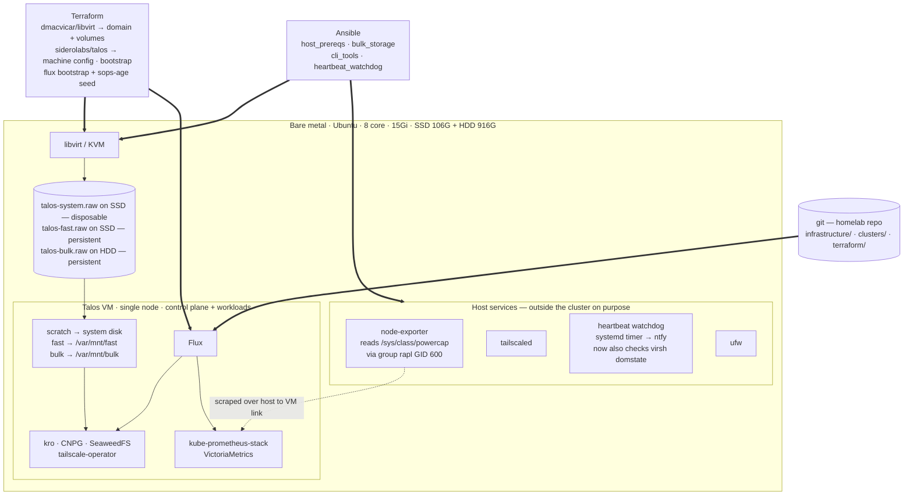

# Talos OS + Terraform migration — viability assessment and design notes

**Status:** investigation only, nothing built, **still iterating**. Records a
full coupling audit of the repo (2026-08-15), the viability verdict, and the
plan shape, so a future execution is executable rather than re-derived. If
executed, this must be recorded as a numbered decision in CONCEPT.md (and D3
amended) per the repo's decision culture — this document is not that decision.
**Question answered:** "Is it viable to move this project to Talos OS managed
by Terraform, shrinking Ansible's role — and what would it take?"

**Direction change (2026-08-15, later same day).** The original plan below —
re-image the host to bare-metal Talos — has been **superseded as the primary
direction** by a virtualised variant: Ubuntu stays on the metal as a
hypervisor, Terraform provisions a single Talos VM, Flux is unchanged. See
[Primary direction](#primary-direction-ubuntu-hypervisor--single-talos-vm).
The bare-metal plan is retained below as Alternative A: its coupling audit,
mapping table and forced `infrastructure/` changes are still accurate and
mostly still apply, and it remains the end-state to fall back toward if the
hypervisor layer proves to be more cost than it's worth.

Two intermediate shapes were explored and rejected on the way; see
[Rejected same-hardware shapes](#rejected-same-hardware-shapes).

**Second revision (2026-08-16) after external review.** The two-disk storage
sketch has been replaced by a hardware-agnostic three-disk design with a
matching change to the platform API's `persistence` field; see
[Storage and developer experience design](#storage-and-developer-experience-design).
Several questions are now answered (Q1, Q7, Q24, Q25) and Q4's premise turned
out to be false. Version claims in this document were verified against upstream
release history on 2026-08-16 and are dated where they appear — re-check before
relying on them, per the repo's pinning convention.

**Third revision (2026-08-16, same day).** Two operator decisions collapsed a
large part of the plan:

1. **The migration is greenfield** — the current cluster's data is PoC material
   and is not being migrated. Backups stop gating cutover; the whole
   dump/restore runbook goes away.
2. **k3s is stopped, not run in parallel**, giving the VM the whole machine.

Together these dissolve the two questions that had been ranked most decisive
(Q27 memory contention, Q28 hostname collision) and replace the parallel-platform
phase with a simpler and safer one — see
[The fallback model](#the-fallback-model-stopped-not-destroyed). What remains to
decide before starting is collected under
[Prerequisites to start](#prerequisites-to-start); how platform work itself
changes afterwards is under
[Platform development after the move](#platform-development-after-the-move).

## Answers locked in (2026-08-15)

Four forks were put to the operator; the answers shape everything below:

1. **Hardware:** no second machine yet. The migration re-images the current
   host; a second machine slots in later.
2. **Topology:** two single-node clusters (prod + non-prod), not one 2-node
   cluster — D3's reversal clause made concrete. Control plane on both nodes of
   a 2-node cluster was considered and rejected (etcd wants odd quorum; 2 CPs
   is strictly worse than 1).
3. **Power metrics:** keep. The RAPL udev+GID-600 mechanism is not expressible
   in Talos machine config, so a small privileged DaemonSet workaround ships
   with the migration.
4. ~~**Data safety:** one-shot hand migration (pg_dump / s3 sync / rsync)~~
   **Superseded 2026-08-16: the migration is greenfield.** Everything on the
   current cluster is PoC/experimentation data and is explicitly not worth
   migrating. No pg_dump, no s3 sync, no rsync. Two consequences worth stating
   plainly rather than discovering later:
   - **Backups stop being a cutover gate** (revising correction 3 below). They
     do *not* stop being platform work — C6/C9 still call real CNPG backups a
     must, and D8/S3 still want the rebuild to double as a verified restore
     test. LES-68 remains open on its own merits, just not on this critical
     path.
   - **The one exception worth ten minutes:** VictoriaMetrics holds the
     long-term `node_rapl_*` power history (Prometheus is D4-disposable by
     design and is *not* the store that matters here). It sits on
     `local-path-bulk`, where the entire disk is 4.6M used — so copying it out
     is close to free. Optional, but the cheapest thing on this list and the
     only history that cannot be regenerated.

## Verdict

Viable, and unusually well-aligned with CONCEPT.md rather than a distraction
from it:

- **D3's reversal clause** literally names the chosen topology: "a second
  machine arrives and a dedicated non-production cluster becomes affordable."
- **C9/S3/D8** already demand a rehearsed bare-metal rebuild ("the rebuild is
  the tier-1 upgrade mechanism"). Talos+Terraform makes the entire host
  declarative, versioned and diffable — including the HDD fstab entry that
  Ansible doesn't even manage today.
- **§10 learning objectives** include "IaC: the boundary between config
  management and orchestration." Terraform owning machine lifecycle while Flux
  owns cluster state is that boundary taught properly.
- **Principle 5** ("boring where it doesn't teach") cuts *for* Talos: an
  immutable, SSH-less, API-driven OS is less OS toil; the novelty budget moves
  to Terraform, which is on the learning list.

## Primary direction: Ubuntu hypervisor + single Talos VM

Ubuntu stays on the metal and becomes a hypervisor. Terraform provisions one
Talos VM under libvirt/KVM. Flux and everything in `infrastructure/` carries on
essentially unchanged. Ansible shrinks from five roles to four, but changes
job: it owns **the metal**, not the cluster.

The ownership boundary this produces is the point:

| Layer | Owner | Scope |
|---|---|---|
| Bare metal | **Ansible** | packages, hypervisor, bridge, ufw, disks, host observability, watchdog |
| VM + cluster lifecycle | **Terraform** | libvirt domain/volumes, Talos machine config, bootstrap, Flux bootstrap |
| Cluster state | **Flux** | everything under `infrastructure/`, unchanged |

That is §10's "boundary between config management and orchestration" taught
with *both* sides present — arguably better than Alternative A, which teaches
it by deleting one side.

### Desired design state



### What this buys over Alternative A

- **The cutover stops being a leap.** The Talos VM is built *beside* the
  running k3s cluster. If the rehearsal fails, a working cluster is still
  there. This removes Alternative A's own #1 listed cost — "one risky cutover
  with no fallback machine".
- **Never touch bare metal again.** Adding a second node or a second cluster
  later is a `terraform apply`, not a re-image. This is the "makes future
  migration easier" motive, obtained without running two of anything today.
- **ufw survives**, so the tailnet-only posture survives with it — dropping
  Alternative A's "LAN-exposed API/metrics ports" cost. (Conditional on the
  networking mode; see Q11.)
- **The host stays SSH-able on the tailnet** — a fallback box Alternative A
  deliberately gave up.
- **The RAPL privileged-DaemonSet workaround disappears** (see below).

### What it costs

- Ubuntu stays, so Talos's "no OS toil" benefit is only partly realised, and
  the sudo-rs workaround in `ansible.cfg` stays with it.
- Two layers to debug when something breaks.
- Memory can't be overcommitted at 15Gi — the VM's RAM is spent, not shared.
- The VM's system disk lives on `/`, which has **61G free**. Tightest resource
  in the design.

### Ansible role fates

| Role | Fate |
|---|---|
| `host_prereqs` | **Survives, grows.** Hypervisor packages (qemu-kvm, libvirt-daemon-system, virtinst, OVMF), bridge/network, sysctls, ufw, RAPL group + udev rule **unchanged**, plus host node-exporter |
| `bulk_storage` | **Survives, reduced.** Keeps `/mnt/storage` mounted and asserted; now hosts the VM's bulk disk image rather than PV directories |
| `cli_tools` | **Survives, grows.** Add `talosctl` and `terraform` to the pinned set in `roles/cli_tools/vars/main.yml` |
| `heartbeat_watchdog` | **Survives, improves.** Stays on the host, outside the cluster, and can now also check `virsh domstate` — it detects "the VM is down", which an in-cluster CronJob structurally cannot. Alternative A had to weaken this into an external dead-man's switch |
| `k3s_server` | **Dies.** Replaced by Terraform + the talos provider |

### The finding that reshapes observability

**In a VM, node-exporter cannot read RAPL at all.** `/sys/class/powercap` is
host-CPU MSR-backed and is not exposed to guests — there is no powercap class
inside the guest, so no privileged-DaemonSet workaround helps. Locked-in
answer #3 ("keep power metrics") survives, but not the way Alternative A plans.

And it is not only RAPL. Every node-level series — disk, network, CPU, memory
— would silently start describing *the VM* rather than the machine. The power
dashboards would go blank, which is visible; the rest would go quietly wrong,
which is worse.

The fix is one the repo has already done once: **run node-exporter on the
Ubuntu host**, not in the cluster. `observability/helmrelease.yaml:167` records
that this was the original podman setup. Consequences:

- The RAPL udev rule + `rapl` GID 600 stay in `host_prereqs`, working,
  untouched. Alternative A's privileged DaemonSet — and the security argument
  it forced — both disappear.
- `hostNetwork: true` / `hostPID: true` on the DaemonSet go away, replaced by
  a static scrape target.
- The hard-won CPU-throttling analysis at `helmrelease.yaml:177-197` (50m →
  500m, and *why*) must be **re-homed into the host unit, not deleted** — the
  netclass collector still walks ~20 interfaces.

## Storage and developer experience design

Added 2026-08-16 after external review. This section supersedes the two-disk
sketch the diagram above originally carried, and it is the part of the design
most worth getting right, because it is the part that decides how portable the
platform is and how much an app author has to know.

### The principle

> **The cluster knows disk *roles*, never disk *paths*.**

Each layer names storage in its own vocabulary and translates exactly once.
This is how managed cloud storage works — a consumer asks for a service class,
not for a device — and it is what makes the platform portable to the second
machine, to `homelab-nonprod`, and back to bare metal if the hypervisor layer
is ever judged not worth its cost.

| Layer | What it knows | Vocabulary |
|---|---|---|
| Ansible (host) | that an SSD and an HDD exist, and which image file lives on which | `/`, `/mnt/storage` |
| Terraform | three virtual disks, each stamped with a stable serial | `system`, `fast`, `bulk` |
| Talos machine config | a CEL selector per disk → `/var/mnt/fast`, `/var/mnt/bulk` | disk serials |
| Cluster (Flux) | two provisioners rooted at `/var/mnt/*` | StorageClass names |
| App author | "1Gi of fast storage at /app/data" | `size`, `tier` |

Hardware appears **only in the first row**. Everything below it sees service
classes. Today's design leaks hardware into all five rows —
`/mnt/storage/k8s-volumes` in a ConfigMap, `/home/lestherll/projects/<app>/data`
in the platform API — and that leak is what this section closes.

**The join is the disk serial.** libvirt lets Terraform stamp a `<serial>` on
each virtual disk; Talos selects on it with a CEL expression rather than on
`vdb`/`vdc` enumeration order, so the mapping survives a disk being added,
removed or re-ordered. **Phase 1 must verify by hand that the serial actually
surfaces in Talos's disk properties** before Terraform is built to depend on
it. Fallback selectors are disk size or transport — uglier, and order-fragile.

### Why three disks, and what the rule actually is

Two independent reasons force data off the system disk, and neither is about
hardware:

1. **Lifecycle.** `terraform destroy` of the VM must not destroy data. That is
   the property that makes the VM a rehearsal of D8's bare-metal rebuild rather
   than a liability, and it requires persistent data to live on disks the VM's
   own lifecycle does not own.
2. **Blast radius.** Today a runaway PVC can consume the entire SSD — AGENT.md's
   "local-path PVCs have no quota" is unbounded at the node level. With `fast`
   as its own fixed-size volume, a runaway fills that volume and nothing else;
   the node stays up and the system disk is untouched. This is a containment
   improvement the current bare-metal layout cannot offer at all.

So the rule to hold onto is not "three disks". It is:

> **One disposable system disk, plus one persistent data disk per service class
> the platform offers.**

Two classes today, so three disks. A third class later is a fourth disk and no
redesign.

`UserVolumeConfig` is the mechanism (confirmed against Talos v1.11 docs,
2026-08-16, answering Q7): volumes are selected by CEL, mount at
`/var/mnt/<name>`, take `minSize`/`maxSize`/`grow`, and format as ext4 or xfs.

### Sparse images, not preallocated ones

`/` has 61G free (measured 2026-08-16: 106G total, 40G used). The `system` and
`fast` images both live there. k3s is stopped rather than deleted at cutover,
so its ~13G of uncollected containerd layers are still occupying `/` until
Phase 5 — the sizing has to assume they are present.

Create both with `qemu-img create -f raw`, which produces a **sparse** file on
ext4: it consumes only blocks actually written, while keeping raw's performance
profile — which matters, because `fast` carries CNPG WAL fsyncs and qcow2's
write amplification would land directly on them.

**Sparse allocation is load-bearing here, not an optimisation.** It is also a
familiar hazard one layer down: three thin images can collectively overcommit
`/`, and the host's `df` will under-report the commitment — the same shape as
the local-path no-quota trap. It needs the same treatment: application-level
bounds inside the cluster (Prometheus `retentionSize` already does its share)
plus a host-level alert on `/` free space, because the guest will keep writing
happily until the host filesystem fills underneath it.

The HDD is not a constraint: 916G with 4.6M used. The bulk image is free, which
sharpens the "do this sooner rather than later" point above.

### Rename the storage classes — cutover is the only free moment

| Today | New | Contract offered to a consumer |
|---|---|---|
| `local-path` (default) | `scratch` | disposable, `Delete`, on the system disk |
| `local-path-retain` | `fast` | durable, low-latency, small |
| `local-path-bulk` | `bulk` | durable, high-capacity, sequential |

The current names describe implementation (`local-path` is a provisioner, not a
promise) where they should describe the guarantee. StorageClasses cannot be
renamed in place — the only migration path is create-new-and-move-every-PVC.
But cutover already recreates all three on a fresh cluster and restores from
dumps, so **the rename costs nothing on cutover day and becomes a full storage
migration on any day after it.**

The blast radius is smaller than it looks, and it was checked: **no app repo
names a StorageClass.** `Database` hardcodes `local-path-retain` inside
`rgd-database.yaml`, `ObjectStorage` never touches storage classes, and
`Application` uses a hostPath rather than a PVC. The change is entirely internal
to this repo.

This also **dissolves Q24**. `DEFAULT_PATH_FOR_NON_LISTED_NODES` stops being a
hazard, because `/var/mnt/bulk` is identical on every node by construction — the
guarantee moves out of an Ansible assert and into machine config. One caveat
worth writing down: a node whose config omits the volume would silently get a
directory on its system disk, so the volume must be declared for every node in
the class. That is declarative and reviewable, which is strictly better than
today's imperative assert.

And `bulk_storage`'s mount assert **survives unchanged**, now load-bearing in
exactly one place: if `/mnt/storage` is not mounted when libvirt opens the bulk
image, the image is created on the SSD. That is the correct home for a hardware
assertion, and it is the only one left.

### Make no StorageClass the default

Today `local-path` is the cluster default because k3s made it so — the choice
was never taken. On Talos all three classes are repo-created, so it has to be.

**Set no default at all.** A PVC that names no class then stays `Pending`,
loudly and immediately, instead of silently landing somewhere wrong. The
alternatives are both worse: defaulting to `scratch` preserves today's footgun
(a chart that omits `storageClassName` silently gets `Delete` storage), and
defaulting to `fast` puts every disposable PVC on the most contended disk.

The cost is one explicit `storageClassName` on each of the three observability
PVCs, all of which are already repo-managed. The benefit lines up with D4:
CONCEPT.md:445 records that durability classification is only partly realised
and that no unlabelled-volume alert exists — forcing the choice at PVC creation
is the cheapest available way to close part of that gap, and it needs no alert
because the failure is a `Pending` volume rather than a missing label.

### The DX change that matters most: `Application.persistence`

The platform API is already close to the target shape — `spec: {size: small}`
for a `Database`, `spec: {}` for an `ObjectStorage`. There is exactly one wart,
and it is also the worst hardware leak in the repo
(`rgd-application.yaml:56`):

```yaml
persistence:
  hostPath: /home/lestherll/projects/myapp/data   # required
```

A named user's home directory, in a platform API, that an app author has to
know and type. Replace it with a PVC:

```yaml
persistence:
  size: 1Gi              # default "1Gi"
  tier: fast             # enum fast|bulk, default "fast"
  mountPath: /app/data   # default, unchanged
```

This mirrors the existing `size: small|medium` idiom exactly, so it adds no new
concept for an app author while deleting the only field that required knowing
anything about the machine. It also makes an app's `deploy/` directory portable
to `homelab-nonprod` unchanged, which is the point of D3's topology.

This supersedes Alternative A's forced change #6 (`Directory` →
`DirectoryOrCreate`), which only patched the symptom.

**On Q25: do not rescue the personal-finance-dashboard host CLI with virtiofs.**
Talos virtiofs support is doubtful, and even if it worked it would reintroduce
precisely the coupling this section exists to remove — a bind mount from a named
user's home directory into the guest. Let the host CLI die as forced change #6
already accepted; it moves into a container or becomes an endpoint on the app.

### What this section answers or changes

- **Q7** answered: `UserVolumeConfig`, `/var/mnt/<name>`, CEL disk selection,
  `minSize`/`maxSize`/`grow`. `machine.disks` is the older API; do not use it.
- **Q24** dissolved: the path is uniform across nodes by construction.
- **Q25** answered: a PVC, and virtiofs rejected.
- **Q22** reinforced: file-backed images are exactly what lets the host keep
  owning physical placement while the guest stays hardware-agnostic.
- **Q6** narrowed: only the *system* disk's growth story still matters, since
  persistent data no longer lives there and `grow` handles expansion.
- **Q26** largely moot: sparse images mean declared size stops competing with
  the 61G while k3s's data is still on disk.
- **Forced change #1** grows: the SSD needs **two** provisioner instances, not
  one, because `local-path` and `local-path-retain` are served today by a single
  instance with a single `nodePathMap` and the new design gives them different
  disks. The repo has already proven this pattern once with the bulk tier.

## The fallback model: stopped, not destroyed

Decided 2026-08-16, and it replaces the "parallel platform" idea the exploration
plan was originally built around. The two clusters do **not** need to run
simultaneously with full platforms — which is fortunate, because Q27 says they
cannot.

> **Stopping k3s is reversible. Re-imaging is not.**

`systemctl stop k3s` frees the entire 15Gi for the Talos VM while leaving every
byte where it was: `/var/lib/rancher/k3s/storage` and `/mnt/storage/k8s-volumes`
both remain intact on disk. If the VM fails at any point, `systemctl start k3s`
restores the old cluster in seconds.

This is strictly better than both shapes considered before it. Alternative A's
full resource budget, *and* the fallback that was the primary justification for
the hypervisor direction — without needing either cluster to run degraded.

**The one hard safety rule of this migration:**

> **Never write into k3s's data paths.** VM images live at dedicated locations
> on each disk — never under `/var/lib/rancher/k3s/storage`, never under
> `/mnt/storage/k8s-volumes`.

Violating it destroys the fallback silently, with no error at the time. Every
other mistake in this plan is recoverable; this one is not. It is also the
reason the `bulk_storage` mount assert matters more than ever: an unmounted
`/mnt/storage` at image-creation time puts the bulk image on the SSD *and* means
the path you thought you were avoiding is not the path you actually wrote to.

**k3s only stops at Phase 3.** With ~8Gi available today, a 4Gi sandbox VM runs
alongside the live cluster, so every derisking phase — including the storage
lifecycle rehearsal that proves the architecture — completes with the cluster
still serving. The stop happens once, late, after the design is known to work.

**The point of no return is Phase 5**, when k3s's data directories are finally
deleted. That is a deliberate act taken when confident, not a side effect of
cutover.

## Prerequisites to start

Nothing here exists yet — the host has no qemu, libvirt, talosctl or Terraform
installed (checked 2026-08-16). It does have 16 threads with virtualisation
extensions, 15Gi RAM and 8Gi swap.

**Decisions — no code, but each blocks a later phase:**

| Decision | Blocks | Leaning |
|---|---|---|
| State strategy (Q4) | Phase 2 | OpenTofu, to keep D12 intact |
| Networking mode (Q11/Q12) | machine config | Routed + static IP |
| Tailscale placement (Q13) | Image Factory schematic | Host-only |
| Flux bootstrap owner (correction 8) | Phase 2 module shape | Separate step |
| Talos + Kubernetes versions | everything downstream | pin + date, per convention |
| Default StorageClass | `infrastructure/storage/` | none — see above |

**Host prep (`host_prereqs`, plus `cli_tools`):** qemu-kvm,
libvirt-daemon-system, virtinst, OVMF; operator in the `libvirt` group; two
libvirt storage pools, one per physical disk, at paths that obey the safety
rule above; the routed network definition and matching ufw rules; VM autostart
policy (Q5). `cli_tools` gains `talosctl` and the chosen Terraform/OpenTofu
binary, both pinned with a re-verified date.

**Empirical unknowns — all Phase 1, all cheap:** RAPL absence in the guest; a
libvirt-set disk `<serial>` visible to Talos and matchable by CEL; measured idle
memory; guest-agent graceful shutdown; VM autostart across a host reboot.

## Exploration plan

Reading- and experiment-led; each phase exists to answer questions, and has an
exit criterion. Nothing before Phase 4 touches the live cluster.

**Phase 0 — Read, plus one experiment on the live cluster.** Work the reading
list below. Q1 and Q7 are already answered above; Q6, Q11 and Q16 are the
remainder.

Phase 0 also gets the one experiment that needs **no Talos work at all** and
returns the most information per hour: **stand up node-exporter on the Ubuntu
host now, add it to the live Prometheus as a second scrape target, and find out
which stock kube-prometheus-stack rules and dashboards go blank** (Q18). This is
the migration's most likely source of *silent* breakage — every other major risk
fails loudly and has a phase that catches it, whereas this one fails by a panel
quietly showing nothing. It is testable today against k3s, it is reversible, and
the relabelling it forces is work the migration needs regardless of whether the
migration ever happens. Pull it forward.

Exit: Q6, Q11, Q16 answered; the rest at least scoped; **Q18 quantified — a
concrete list of the rules and dashboards that need relabelling, not an
estimate.**

**Phase 1 — Hand-built sandbox VM.** Install libvirt/KVM on the host. Boot a
throwaway Talos VM by hand with `talosctl`, no Terraform yet. Deliberately
manual so that failures are attributable to Talos, not to a provider.
Exit: a single-node Talos cluster answers `kubectl get nodes`; measured idle
memory footprint recorded; **RAPL absence in the guest confirmed empirically**
(don't take this document's word for it — check this first within the phase,
since a chunk of Phase 3 gets simpler if it turns out to be wrong);
guest-agent shutdown verified; **a libvirt-set disk `<serial>` confirmed
visible in Talos's disk properties and matchable by CEL** (the join the whole
storage design rests on); **virtio-balloon free-page-reporting tried** (Q27).

**Phase 2 — Terraform-ise it.** Write `terraform/modules/talos-cluster/` and
drive the same sandbox VM from it, against the pinned stack (Terraform/OpenTofu
version × libvirt provider 0.9.8 × host libvirt × Talos version × talos
provider 0.11.x). Destroy and recreate from scratch at least three times.
Exit: reproducible from zero; state handling **decided** (Q4) — this is the
phase it blocks; provider health (Q1) answered by use rather than by reading.

**Phase 2.5 — Storage lifecycle rehearsal.** The experiment that actually
proves the architecture, and the one most worth failing early:

```
create VM + system/fast/bulk disks
  → Talos formats the two data volumes
  → Kubernetes provisions a PVC on each
  → write identifiable data
  → destroy ONLY the VM (data volumes lifecycle-protected)
  → terraform apply
  → volumes reattach, remount at /var/mnt/*
  → data is intact and the PVCs rebind
```

Exit: data survives a full VM destroy/recreate; the CEL disk selector matches
on serial rather than enumeration order; `terraform destroy` provably cannot
take the data disks with it. **If this fails, the whole virtualised direction
is worth less than Alternative A** — so run it before building anything on top.

**Phase 3 — Stop k3s and build the real cluster.** `systemctl stop k3s` (and
disable it, so a host reboot mid-migration doesn't resurrect it competing for
the same tailnet hostnames). Rebuild the VM at full size with the whole machine
available. Point Flux at it and bring `infrastructure/` up for real, in
dependency order: metrics-server → CNPG → SeaweedFS → one `Application` →
observability.

Because the migration is greenfield, **no temporary tailscale hostnames are
needed** (Q28 dissolves): k3s is stopped, so its exposures are gone and the real
hostnames are free. Expect ~4 fresh Let's Encrypt issuances and prune the stale
`ts-*` devices in the tailnet admin console; no loops, so no failed-authorization
risk per `external-consumer-access-notes.md`.

Observability comes up last because it is the memory hog and the thing least
needed while everything else is being proven. Note the window without in-cluster
metrics is well covered: **node-exporter, the RAPL power metrics and the
heartbeat watchdog all live on the Ubuntu host**, outside both clusters, and run
straight through. Host health, power and the dead-man's switch never go dark.
The host-side relocation was adopted to fix measurement correctness; that it
also covers the cutover window is a second thing it buys.

Exit: `infrastructure/` fully reconciled on Talos; all four ingresses serving
TLS; `node_scrape_collector_success{collector="rapl"} == 1` off the *host*
exporter; power dashboards live; Q18's relabelling holding in practice.

**Phase 4 — Verify and live on it.** Recreate the `Database`/`ObjectStorage`/
`Application` instances for the app repos — empty, no restore, since the
migration is greenfield. Run on it long enough to trust it. k3s stays stopped
but restorable throughout.

**Phase 5 — Aftermath and the point of no return.** Only once confident: delete
k3s's data directories, reclaiming ~13G of uncollected containerd layers along
with them. Delete the `k3s_server` role; rewrite the surviving roles; update
AGENT.md, `storage-tiering-notes.md` paths, and CONCEPT.md (new decision, D3
amendment, D8 amendment per Q8).

### Do this sooner rather than later

`/mnt/storage` is currently **4.4M used of 916G** — the bulk tier is
effectively empty. The data-preservation step that Alternative A calls its
"single biggest technical unknown" is nearly free *right now*, and gets
steadily more expensive as SeaweedFS and VictoriaMetrics accumulate history.

## Feasibility: what could actually stop this

Ranked, 2026-08-16. The list has been through two reorderings in one day, which
is itself the useful record — see the demotions at the end.

1. **Q18, the node-exporter relabelling.** Now the top risk, and the only major
   one that fails *silently* — a panel quietly showing nothing rather than an
   error. Pulled forward into Phase 0 for exactly that reason; it needs no Talos
   work and is testable today.
2. **RAPL absence in the guest.** Load-bearing for the whole observability
   redesign and still only asserted by this document. Cheap to verify; do it
   first within Phase 1.
3. **The libvirt provider's 0.9 rewrite.** Real but bounded — pinning plus
   Phase 2 is the mitigation, and Q1's fallbacks exist if it disappoints.
4. **Two layers to debug.** Not a discrete risk, a standing tax. Named because
   it is the cost that does not go away after cutover.

**Demoted — and worth recording why, since both were once called the single
biggest unknown:**

- **Talos adopting the populated whole-disk-ext4 `/dev/sda`.** Removed entirely
  by file-backed images: the host keeps owning the physical filesystem and Talos
  only ever meets clean virtual block devices.
- **Memory.** Was the binding constraint while the plan assumed two full
  platforms running in parallel. The stopped-not-destroyed fallback removes the
  contention: k3s is stopped before the real VM is built, so the VM gets the
  whole machine. What remains is a sizing question, not a feasibility one.

The lesson to carry: both were artifacts of a plan shape, not of the target
architecture. Changing the shape dissolved them. Phase ordering should keep
following the risk rather than the build order.

## Platform development after the move

The question this has to answer is not "can apps still run" — it's how *platform*
work feels afterwards, since D16 and further data services are the work actually
remaining. Short version: the operator workflow is mostly unchanged, one thing
gets substantially better, and one thing gets worse.

**Unchanged, because the host survives.** Unlike Alternative A, `cli_tools`
lives on: `sops`, `flux`, `helm`, `kubectl`, `kubectl-cnpg`, `age` and `awscli`
all stay where they are, on a machine that is still SSH-able over the tailnet.
The suspend-Flux-and-hand-apply loop for testing unmerged changes works exactly
as it does today. Editing an RGD and watching kro reconcile is identical. The
only addition is `talosctl` for machine-level operations.

**Substantially better: cold-apply becomes testable.** This is the real payoff
for the work that remains, and it deserves to be stated as a design goal rather
than discovered as a side effect.

`self-service-platform-design-notes.md`'s implementation log records a whole
class of bug that only appears when reconciling from *nothing* — the
`seaweedfs-runtime` Kustomization exists as a separate Flux Kustomization
precisely because pairing a HelmRelease with CRD-dependent raw manifests
deadlocks on cold apply. Today that class of bug is discoverable only by
accident, because there is no way to get a cold cluster short of rebuilding k3s
by hand.

After the move, `terraform destroy && terraform apply` produces a clean cluster
in minutes. "Does the platform bootstrap from zero?" changes from an
unanswerable question into a routine test — and every new RGD, operator and
data service added from here can be checked against it before it merges. For a
platform whose remaining roadmap is *more kinds and more services*, that is the
single largest workflow improvement available.

It also keeps the recovery path rehearsed. Using destroy/recreate as the *dev*
primitive means D8's tier-1 recovery mechanism gets exercised continuously
rather than annually. Prefer it over libvirt snapshots for this reason: a
snapshot is a second mechanism that is not the one you would use in an
emergency. (Snapshots remain reasonable for the narrower case of testing
something destructive to *data* — a CNPG major-version upgrade, say — where
destroy/recreate deliberately preserves what you want to roll back.)

**A dev VM becomes affordable, for a reason the earlier rejection did not
consider.** "Two single-node clusters on one box" was rejected above on the
grounds that D7's observability budget applies per cluster and two full stacks
do not fit in 15Gi. That reasoning holds for two *production* clusters and is
not revisited here. But a **platform-development** VM is a different
proposition: it needs no kube-prometheus-stack at all, because nothing about
testing whether an RGD reconciles or whether an RBAC aggregation grant is
sufficient requires Prometheus. A 3–4Gi observability-free dev VM fits
comfortably once k3s is gone, and it is the natural home for exactly the work
that remains — new kinds, the `rbac-kro-aggregate.yaml` grants that must
accompany them, and cold-apply testing that would otherwise disturb the real
cluster. Worth building in Phase 5 rather than deferring to hardware that has
not arrived.

**Worse: no shell on the node.** Today, inspecting a local-path PV is
`sudo ls /var/lib/rancher/k3s/storage/...`. On Talos there is no shell and no
SSH — the equivalent is a privileged debug pod mounting the hostPath, or
`talosctl ls`/`talosctl read`. This is a genuine regression for storage
debugging specifically, and storage is where this platform's more interesting
failures have historically been (see the volume-migration runbook in
`storage-tiering-notes.md`). Not a blocker, but budget for it being clumsier,
and consider keeping a documented debug-pod manifest in the repo rather than
reinventing it under pressure.

## Remaining DX gaps (not fixed by this migration)

**It is invisible to app authors, and that is the point.** An app repo's
`deploy/` keeps its `namespace.yaml` + `Database` + `ObjectStorage` +
`Application`, and the only field that changes — `persistence` — gets simpler.
The OS, the provisioning tool and the storage layer underneath all get replaced
and the consumer contract does not move. That is the strongest available
evidence that D15's abstraction was drawn in the right place, and it belongs in
the CONCEPT.md decision if this is executed.

Two DX gaps remain that this migration does **not** address. Both predate it and
neither should be mistaken for something it introduced:

- **Onboarding is not actually self-service.** A new app still needs a commit to
  *this* repo for its Flux pointer object under `infrastructure/<app>/`. So the
  platform API is self-service for *resources* but not for *apps* — the first
  step still requires platform-repo access. This is the largest remaining DX
  ceiling. Fixing it later means either a `GitRepository` discovery pattern or
  an app-registry kind; not scheduled.
- **There is no local development loop**, and killing the
  personal-finance-dashboard host CLI removes the last "run it on the box"
  affordance. The real answer is already scoped in
  `external-consumer-access-notes.md` — an off-platform app consuming
  `Database`/`ObjectStorage` over the tailnet is a local dev loop wearing a
  different hat. That raises that investigation's priority from "interesting"
  to "the replacement for something this migration removes."

## Open questions

Marked **[decisive]** where the answer changes the design rather than filling
it in.

### A. Hypervisor and Terraform layer

1. ~~**[decisive]** Is `dmacvicar/libvirt` healthy enough to depend on?~~
   **Answered 2026-08-16 by release history; confirm by use in Phase 2.** Not
   the abandoned soft spot it was described as. Latest is **0.9.8 (2026-05-31)**;
   0.9.0 (2024-11-08) was a full rewrite onto the Terraform Plugin Framework
   that maps HCL ~1:1 onto libvirt XML. Read the cadence carefully though:
   0.9.0 → 0.9.1 took twelve months, then six releases landed between January
   and May 2026. That is a rewrite being actively debugged, not steady-state
   maintenance — which argues for pinning and for Phase 2 existing at all, but
   not for avoidance. **Pin 0.9.8 and ignore every example written for 0.8.x**;
   the schema changed substantially. Fallbacks unchanged: the Incus provider, or
   Terraform-manages-nothing-but-Talos with a static libvirt XML.
2. How does the Talos disk image get into a libvirt storage pool — does the
   provider fetch and convert, or is it pre-staged with `qemu-img`? raw vs
   qcow2, and which one Talos expects.
3. Image Factory schematics: which system extensions are needed?
   `qemu-guest-agent` is near-certainly required for graceful shutdown on host
   reboot (matters on domestic power — §8). Tailscale extension only if Q13
   says the VM joins the tailnet. How does the schematic ID get pinned and
   versioned in Terraform, per the repo's pinning convention?
4. **[decisive]** tfstate still contains the Talos PKI. **The premise this
   question was written on is false, verified 2026-08-16: Terraform's CLI has
   no native state encryption at any version.** State confidentiality is a
   property of the chosen backend (S3 SSE, GCS encryption); Terraform 1.10
   added *ephemeral values*, which is a different thing. **OpenTofu 1.7+ does
   have client-side state and plan encryption**, and that is the option which
   actually preserves what this question was protecting — with a PBKDF2 or
   external key provider it keeps tfstate a *derived* secret under the existing
   age key rather than a second root one, preserving D12. So the fork is:
   - **A — OpenTofu** for state encryption, keeping D12 intact. Costs a
     divergence from Terraform proper, against a learning objective that names
     Terraform.
   - **B — Terraform + local state on encrypted storage**, with the state file
     documented and handled as a root secret. Honest, and reasonable for one
     operator, but D12's "one key" becomes "one key plus one state file".
   - **C — Terraform, minimising what reaches state** via the Talos provider's
     ephemeral resources (stable since 0.11.0), narrowing B's exposure without
     removing it.
   Not a blocker for Phase 1, which builds nothing Terraform owns. **Decide
   before Phase 2**, since it determines the state layout.
5. Does the VM autostart after host reboot, and does Ansible or Terraform own
   that setting? (Boundary question, not just a flag.)

### B. Talos in a VM

6. **[decisive]** Disk layout: does Talos want the whole virtual disk, and can
   the EPHEMERAL partition grow when the backing image is resized later? The
   answer determines whether the 61G-free constraint is permanent or
   temporary.
7. ~~**[decisive]** `machine.disks` vs `UserVolumeConfig`~~ **Answered
   2026-08-16** against the Talos v1.11 reference: `UserVolumeConfig` is
   current. Volumes are matched by CEL expression, mount at `/var/mnt/<name>`
   with partition label `u-<name>`, and support `minSize`/`maxSize`/`grow` and
   ext4/xfs. The Alternative A mapping table's `machine.disks` row is written
   against the older API and should not be followed. See the storage design
   section above.
8. Talos upgrade story (`talosctl upgrade`, `upgrade-k8s`) — it reboots the
   node. How does that interact with libvirt, and what does it do to D8's
   "the rebuild is the tier-1 upgrade mechanism"? **Proposed resolution: keep
   both, and say which is which.** Routine OS movement uses Talos's native
   in-place upgrade; the Terraform rebuild-and-reattach becomes the tier-1
   *recovery and replacement* mechanism rather than the tier-1 *upgrade* one.
   That is a strengthening of D8 rather than a retreat from it — the rebuild
   stays rehearsed and stays the thing that proves restores work, but it stops
   being the only road forward. If executed, this needs to land as the D8
   amendment in the new CONCEPT.md decision, not just here.
9. `allowSchedulingOnControlPlanes: true` is needed **day one**, not when a
   second node arrives. (Alternative A files this under "when machine #2
   arrives", which reads wrong.)
10. Does anything about the single-node/single-CP etcd configuration need
    explicit attention, or are the defaults right?

### C. Networking

11. **[decisive]** Bridged vs routed/NAT. Bridged is simpler but the VM gets
    its own LAN IP and host ufw rules will **not** filter its traffic —
    losing the tailnet-only posture that `host_prereqs` deliberately built.
    Routed/NAT keeps ufw meaningful at the cost of more config. Leaning
    routed.
12. **[decisive]** `certSANs` chicken-and-egg: the VM's API address must be
    known *before* bootstrap, because it is baked into the apiserver cert.
    Routed networking with a static address makes this trivial; bridged DHCP
    does not. This is a second, independent argument for routed.
13. Tailscale placement: host only, VM only, or both? Affects `certSANs`,
    whether tailscale-operator exposures behave identically, and the
    watchdog's MagicDNS use of `alertmanager.tailf4742d.ts.net`. **Leaning
    host-only**, per review: it needs no Tailscale system extension in the
    Image Factory schematic, keeps one tailnet identity, and dissolves the
    `certSANs` problem in Q12 along with routed networking. The in-cluster
    tailscale-operator is unaffected either way — its proxy pods dial out to
    DERP and never need inbound reachability — but **verify that the operator's
    proxies come up behind NAT during Phase 3** rather than assuming it.
14. Prometheus in the VM must scrape node-exporter on the host — which
    direction through ufw, and which address family/interface?
15. Does the "MagicDNS names don't resolve from inside pods" gotcha in
    AGENT.md change shape now that there is a host↔VM hop?

### D. Observability relocation

16. **[decisive]** How is host node-exporter run — systemd unit + pinned
    binary, podman/quadlet, or the distro package? Determines where the
    pinning convention applies and where the CPU-limit analysis re-homes to.
17. How does Prometheus discover it — `additionalScrapeConfigs` (needs a
    Secret) or a `ScrapeConfig` CR? The latter is cleaner if the operator
    version supports it.
18. **Which kube-prometheus-stack dashboards and alert rules assume
    node-exporter is a DaemonSet** with pod/node labels? The stock node rules
    join on specific label sets; relabeling will be needed so the existing
    dashboards and the power dashboards keep working. Budget real time here —
    this is the most likely source of silent breakage.
19. Node-level disk/network series now describe the VM's virtio devices. Are
    the host's real disks wanted too, and how are the two distinguished?
20. Does the D7 ~20% observability budget need restating, now that part of the
    stack runs outside the cluster where the budget isn't enforced by
    container limits?

### E. Storage

21. Nested filesystem overhead — ext4 inside a raw image on ext4 — for
    SeaweedFS volume data on a 5400rpm spindle. Likely dominated by the disk
    itself, but measure rather than assume.
22. File-backed images vs raw block passthrough of `/dev/sda`. File-backed is
    preferred: the host keeps owning `/mnt/storage`, so k3s's data stays intact
    and restorable behind the fallback rule, **and** Talos never meets the
    awkward whole-disk-ext4-with-no-partition-table layout `/dev/sda` has.
23. Alternative A's forced change #1 still applies, and **grew**: the SSD now
    needs *two* repo-managed provisioner instances (`scratch` on the system
    disk, `fast` on `/var/mnt/fast`), because the single k3s instance served
    `local-path` and `local-path-retain` from one `nodePathMap`. Still
    **cannot merge while k3s is live**.
24. ~~`DEFAULT_PATH_FOR_NON_LISTED_NODES` → the explicit new node name.~~
    **Dissolved** by the storage design above — `/var/mnt/<role>` is uniform
    across nodes by construction. Caveat recorded there.
25. ~~`rgd-application.yaml:421` hostPath `type: Directory` →
    `DirectoryOrCreate`.~~ **Answered**: replace the hostPath with a PVC
    (`size`/`tier`/`mountPath`) — see the DX section above. virtiofs
    **rejected**: it would reintroduce exactly the host coupling the design
    removes.
26. VM system disk sizing against 61G free. **Largely defused** by sparse raw
    images (see above); what remains is the ordering question, since `/` only
    frees up substantially once k3s and its ~13G of uncollected containerd
    layers are gone, which is after cutover rather than before it.

### F. Migration sequencing

27. ~~**[decisive]** Can k3s and the Talos VM run simultaneously inside 15Gi?~~
    **Dissolved by the stopped-not-destroyed fallback** — they never need to.
    A 4Gi sandbox VM coexists with live k3s through Phase 2.5 (~8Gi available),
    and the real VM is built only after k3s stops. What survives is a *sizing*
    question answered by Phase 1's measured idle footprint, not a feasibility
    one. **virtio-balloon with free-page-reporting** stays worth a Phase 1
    checkbox — less because it is needed now, more because it is what makes a
    second dev VM comfortable later.
28. ~~**[decisive]** Two clusters cannot both serve
    `grafana.tailf4742d.ts.net`.~~ **Dissolved for the same reason** — k3s is
    stopped before the real VM is built, so its exposures are gone and the real
    hostnames are free. No temporary hostnames, no switchover downtime beyond
    the rebuild itself. AGENT.md's failed-authorization warning still applies to
    the ~4 fresh issuances: let them succeed once, don't retry into the limit.
29. ~~Backups (LES-68) before cutover.~~ **No longer a gate** — greenfield
    migration; see locked-in answer #4 and correction 3. Still open as platform
    work, and the one optional data item is VictoriaMetrics' power history.

## Reading list

**Talos**
- Concepts/architecture; the machine config reference, specifically
  `machine.disks` vs `UserVolumeConfig` and the `/var/mnt` convention (Q6, Q7)
- Image Factory + system extensions, especially `qemu-guest-agent` (Q3)
- Running Talos on QEMU/KVM/libvirt — the virtualised-platform guide (Q2)
- `talosctl upgrade` / `upgrade-k8s` and the Talos↔Kubernetes support matrix (Q8)
- Ingress firewall (`NetworkDefaultActionConfig` / `NetworkRuleConfig`) — see
  corrections; may make Q11 moot
- Single control-plane node and `allowSchedulingOnControlPlanes` (Q9)

**Terraform**
- `siderolabs/talos` provider — resource graph, and how sensitive
  `talos_machine_secrets` is in state (Q4). **Use the stable line, 0.11.0
  (2026-04-27)**, which is also where ephemeral resources landed. The 0.12
  series is alpha (six alphas, 2026-05 to 2026-06) and adds `talos_machine` /
  `talos_cluster`; it looks cleaner, but a migration of a live platform should
  not also be the thing that shakes out an alpha resource model. Evaluate it
  separately, after cutover.
- `dmacvicar/libvirt` provider — pin **0.9.8** and treat 0.8.x examples as
  actively misleading (Q1)
- ~~Terraform 1.10+ /~~ **OpenTofu** state encryption (Q4) — Terraform has none;
  see the rewritten Q4
- `fluxcd/flux` provider vs keeping the one-off bootstrap CLI (correction 8)

**libvirt / KVM**
- Disk formats: raw vs qcow2, and performance implications of nesting (Q21)
- virtio-blk vs virtio-scsi; CPU model `host-passthrough`
- Domain autostart and guest-agent-driven graceful shutdown (Q3, Q5)
- Routed vs bridged vs NAT networking, and how each interacts with host
  firewalling (Q11)

**Prometheus / observability**
- Scraping targets outside the cluster: `additionalScrapeConfigs` vs the
  `ScrapeConfig` CRD (Q17)
- kube-prometheus-stack's node-exporter rules/dashboards and the labels they
  join on (Q18)
- node-exporter as a host service: systemd hardening, and the collector set
  worth enabling on a hypervisor

**Verify independently**
- That RAPL/powercap really is unavailable to KVM guests (Q — Phase 1 exit
  criterion). This document asserts it; confirm it before designing around it.

## Corrections to Alternative A

Carried forward from review; these apply to the sections below regardless of
which direction wins.

1. **"No host firewall on Talos" is likely wrong.** Talos has had a built-in
   ingress firewall since ~v1.6 (`NetworkDefaultActionConfig` +
   `NetworkRuleConfig`), which can scope 6443/50000/9100 to the tailnet
   interface. If it holds, one of the listed costs disappears and so does the
   "LAN-exposed API/metrics ports" line in the cost sheet. Verify against
   current docs.
2. **`tls-san` has a chicken-and-egg problem.** `cluster.apiServer.certSANs`
   is baked in at bootstrap, but under Alternative A the tailscale IP only
   exists *after* the system extension joins — and a fresh join may not
   reclaim the current IP. A CIDR cannot go in `certSANs`. Needs an explicit
   two-pass step, or keeping the old tailnet node alive to reclaim its
   address. (Under the primary direction this is Q12, and routed networking
   largely dissolves it.)
3. ~~**Backup ordering contradicts the D8 citation.**~~ **Withdrawn as a
   cutover gate, 2026-08-16** — the migration is greenfield (locked-in answer
   #4), so there is no data whose loss the backup would prevent, and the
   fallback is `systemctl start k3s` rather than a restore. The *argument*
   still stands on its own though, and outlives this migration: D8/S3's point
   is that a rebuild doubles as a verified restore test, which requires the
   restore path to exist first. Once the platform holds data worth keeping,
   LES-68 stops being follow-up work and becomes a precondition for claiming
   D8 is realised at all.
4. **Step 2's "single biggest technical unknown" is overstated and
   under-mitigated.** It cannot be rehearsed in a VM without the actual disk —
   only against a synthetic proxy. But it is also less frightening than
   framed: full dumps are being taken anyway, so the fallback is
   wipe-and-restore. Say so. Note also that `/dev/sda` is whole-disk ext4 with
   **no partition table**, which is the awkward case for a Talos disk config
   that wants to partition — so this is *more* likely to fail than the text
   implies, not less.
5. **`allowSchedulingOnControlPlanes: true` is a day-one requirement**, not a
   machine-#2 one. Make it a module invariant tied to single-node rather than a
   free-floating flag: `single_node = true` implies it.
6. **`machine.disks` is the wrong API** (Q7). The mapping table's
   `bulk_storage` row should read `UserVolumeConfig`.
7. **The two-disk layout is insufficient** — see the storage design section.
   Alternative A inherits this: even on bare metal, "system disk plus HDD"
   leaves `local-path-retain` sharing a device with the OS.
8. **Flux bootstrap ownership is a genuine fork, not a settled question.**
   The mapping table puts `flux_bootstrap_git` in Terraform, justified by D12
   (the deploy key is read through the age key, so the chain still terminates
   at one root). Review argued for a separate explicit `flux bootstrap` step
   instead, on separation-of-concerns grounds: Terraform owns *infrastructure*
   lifecycle, Flux owns *cluster* lifecycle, and blurring them blurs the exact
   §10 boundary this migration exists to teach. Note the security half of that
   argument does **not** hold — Terraform never owns the age key, which is
   pre-seeded out of band; it only reads through it. So this is a design
   preference between two defensible shapes, not a defect. Decide it in
   Phase 2; the two-step form is easy to collapse into one later, and the
   collapsed form is harder to split.

## Rejected same-hardware shapes

Both were considered for getting two environments onto the current machine
before a second one arrives.

**Two single-node clusters on one box.** Requires a hypervisor layer that the
bare-metal plan never accounts for. D7's ~20% observability budget applies per
cluster — two full kube-prometheus-stacks is a large fraction of 15Gi before
any workload runs — and Talos costs *more* RAM per cluster than k3s, which
runs apiserver/scheduler/controller-manager/kubelet in one process. Worst, a
same-box non-prod isolates almost nothing worth isolating: not host failure,
not disk, not power, and not the rebuild rehearsal, since re-imaging kills
both. It does isolate cluster-level blast radius — a bad CRD, an operator
upgrade, an apiserver arg — which is real but narrow, and is what D3 already
decided namespaces cover.

**Two nodes in one cluster on one box.** Weakest of the options. As 2 control
planes it is already rejected above (etcd wants odd quorum; every Talos
upgrade reboots and would take the API down). As 1 CP + 1 worker it pays every
multi-node cost for no fault tolerance, since host, disk and power are shared
and §8 says assume unplanned reboots. **Storage is what actually breaks it:**
every PV is a node-pinned hostPath, so Prometheus, Grafana, Alertmanager,
VictoriaMetrics, SeaweedFS and every CNPG `Database` become pinned to whichever
node scheduled them first — single-node semantics with a scheduler that can now
strand pods. The HDD reaches exactly one VM, so `local-path-bulk` exists on one
node only. And `bulk-provisioner-config.yaml:20`'s
`DEFAULT_PATH_FOR_NON_LISTED_NODES` turns from harmless into a live hazard: on
the node without the HDD the provisioner silently writes onto that node's root
disk — precisely the failure `bulk_storage`'s assert exists to prevent, arriving
before its replacement exists. Fixing it properly means Longhorn or Ceph
replicating a 5400rpm spindle to itself on one machine: a large novelty spend
against Principle 5 for zero durability gain, teaching the wrong lessons about
storage.

---

# Alternative A — bare-metal Talos (original plan)

Superseded as the primary direction, retained in full. The coupling audit,
mapping table and forced `infrastructure/` changes below remain accurate and
mostly still apply to the virtualised design; the corrections above apply here.

**Two things below are now historical rather than planned:** the cutover
runbook's dump/restore steps (the migration is greenfield — locked-in answer
#4) and its framing of verified dumps as the safety net (the fallback is now
`systemctl start k3s`). Read them as a record of the bare-metal plan, not as
instructions.

## What moves where (Ansible → Talos/Terraform mapping)

| Today (Ansible on Ubuntu) | Under Talos + Terraform |
|---|---|
| `k3s_server` role (get.k3s.io installer, `config.yaml`, kubeconfig copy) | `siderolabs/talos` TF provider: `talos_machine_secrets` → `talos_machine_configuration` → `talos_machine_configuration_apply` → `talos_machine_bootstrap` → `talos_cluster_kubeconfig`. `tls-san` → `cluster.apiServer.certSANs` (include the tailscale IP). `disable: [traefik, servicelb]` is a no-op — Talos ships vanilla k8s, neither exists. No k3s token exists to migrate (installer-generated, never in inventory). |
| `host_prereqs` sysctl (`net.ipv4.ip_forward`) | `machine.sysctls`. Trivial. |
| `host_prereqs` ufw (9100/6443 scoped to tailscale0, 22 open, FORWARD=ACCEPT) | Dies. No host firewall on Talos. Accepted delta: API server and node-exporter ports exposed on the domestic LAN (§8 threat model). The SSH rule vanishes with sshd itself. |
| `host_prereqs` RAPL udev rule + `rapl` group GID 600 | **Not expressible** (no custom udev rules, no group management, no arbitrary file writes). Replacement: a small privileged DaemonSet that only chgrp/chmods `/sys/class/powercap/**/energy_uj` (mounts nothing else, no hostPID, busybox image, re-applies on a short loop for late-appearing zones). The pod half (`securityContext.supplementalGroups: [600]` on node-exporter) is unchanged. `runAsUser: 0` on node-exporter stays rejected — on Talos, mounting host `/` exposes the STATE partition (machine config = cluster CA), arguably worse than `/etc/shadow` + age key today. |
| `bulk_storage` (mount assert + mkdir) | ~~`machine.disks`~~ **`UserVolumeConfig`** (see correction 6) mounts the HDD under `/var/mnt/<name>` (Talos mounts user volumes there, not `/mnt/storage`). The assert becomes unnecessary — the mount is declarative. The `local-path-bulk` nodePathMap path must follow. |
| `cli_tools` (age, flux, sops, helm, kubectl-cnpg, awscli on the host) | Whole role vanishes — Talos has no shell or package manager. Re-home to the operator workstation (mise/nix, or a slimmed Ansible kept *only* for workstation tooling), plus `talosctl`. |
| `heartbeat_watchdog` (systemd timer + curl + ntfy, on-host by design) | Not expressible on Talos (no file writes, no user systemd). Replacement: in-cluster CronJob that curls `alertmanager.tailf4742d.ts.net/-/healthy` and pings an external dead-man's switch (healthchecks.io-style) only on success; the external service pages ntfy when pings stop. Covers **more** than today — AGENT.md explicitly notes the current watchdog does not cover host death; a stopped ping does. Ping URL in SOPS. |
| Host tailscaled (preinstalled, untouched by Ansible, but load-bearing: tls-san, API-over-tailnet, watchdog's MagicDNS) | Siderolabs Tailscale **system extension** via Image Factory schematic; auth key as a TF-managed secret. In-cluster tailscale-operator is untouched. |
| Flux bootstrap (one-off CLI, committed gotk manifests) | `flux_bootstrap_git` in Terraform + pre-seeding the `sops-age` Secret, keeping GP4 "one bootstrap process, one key". The deploy key is read via a SOPS TF data source, so the chain still terminates at the one age key (D12). |
| ansible.cfg / become / sudo-rs workaround | Vanishes with Ansible-on-host entirely. |

## Forced changes in `infrastructure/` (all on a migration branch)

1. **Own SSD provisioner.** k3s ships the `rancher.io/local-path` provisioner;
   Talos ships nothing, but `local-path` (3 observability PVCs) and
   `local-path-retain` (CNPG, SeaweedFS filer; provisioner field immutable on
   the class) both name it. Copy the proven bulk-provisioner pattern (raw
   Deployment + ConfigMap + RBAC) for an instance named
   `rancher.io/local-path`, path on the SSD/EPHEMERAL (e.g.
   `/var/lib/local-path-storage`). **Cannot merge while k3s is live** — two
   same-named provisioners would race the same PVCs. Merges with the migration
   PR on cutover day.
2. **`local-path-bulk` nodePathMap** → the new `/var/mnt/...` path. Also
   replace `DEFAULT_PATH_FOR_NON_LISTED_NODES` with the explicit node name —
   harmless while every cluster is single-node, load-bearing the day one
   grows.
3. **Add `metrics-server` HelmRelease.** Talos doesn't bundle it; `kubectl top`
   (and the resource-diagnose skill) depend on it.
4. **Observability HelmRelease cleanup.** Drop the k3s one-process
   metricRelabelings workaround (dead config on vanilla k8s); disable
   `kubeEtcd`/`kubeControllerManager`/`kubeScheduler` monitors (Talos serves
   these with its own PKI; and nothing is lost — k3s served those series on
   :10250 and they were being dropped anyway); reconsider node-exporter's
   `hostNetwork: true` (its ufw justification is gone).
5. **Watchdog CronJob + SOPS secret** replacing the systemd timer.
6. **`Application` RGD `persistence`.** `/home/lestherll/projects/<app>/data`
   does not exist on Talos (no home dirs, no shell, `type: Directory` can
   never be satisfied imperatively). Change to `DirectoryOrCreate`, constrain
   paths under the bulk mount. **Named casualty:** the host-side CLI workflow
   for personal-finance-dashboard dies; that CLI moves into a container.
7. **RAPL DaemonSet** (item 3 in the mapping table).
8. **D16 note (design-only, unbuilt):** the GitHub-OIDC apiserver args
   re-express as `cluster.apiServer.extraArgs` — one line in
   `self-service-platform-design-notes.md` §8 when the time comes.

## Terraform shape (built for the two-cluster end-state now)

```
terraform/
  modules/talos-cluster/     # secrets, machine config, apply, bootstrap,
                             # kubeconfig, flux bootstrap, sops-age
  clusters/homelab/          # the current laptop, re-imaged — cluster #1
  clusters/homelab-nonprod/  # placeholder until hardware arrives — cluster #2
```

When machine #2 arrives: fill in `clusters/homelab-nonprod/`, one
`terraform apply`, one `clusters/homelab-nonprod/` Flux dir. Set
`allowSchedulingOnControlPlanes: true` (single-CP clusters).
**tfstate contains the Talos PKI and the git deploy key** → local state with an
encrypted backup stored alongside the age key; record it as a second root
secret next to D12's one.

## Cutover runbook (no second machine = no safety net; verified dumps are the safety net)

1. **Prep (zero risk).** Land pending branches. Build everything above on
   `feat/talos-migration`. `terraform validate`; generate machine configs.
2. **Rehearse.** Boot Talos in a QEMU VM on the laptop itself and run the
   module end-to-end. Specifically verify that **Talos mounts an existing,
   populated ext4 disk without reformatting it** — that is what preserves the
   SeaweedFS volume data and VictoriaMetrics history on the HDD in place.
   Single biggest technical unknown; if the rehearsal fails, do not re-image.
3. **Cutover day (a Saturday).** Dump, verify dumps, then re-image:
   - `pg_dump` every live CNPG `Database` (kubectl-cnpg 1.30.0 already
     installed) → external disk/workstation
   - `aws s3 sync` every SeaweedFS bucket out over the tailnet
   - rsync the personal-finance-dashboard hostPath data out
   - record disk by-ids, the HDD filesystem UUID, the tailscale IP
   - boot Talos ISO → `terraform apply` → Flux reconciles → ~4 fresh Let's
     Encrypt issuances, as expected on any exposure recreate (grafana,
     alertmanager, fastapi-echo, personal-finance-dashboard; prune the stale
     `ts-*` devices in the tailnet admin console; no loops → no
     failed-authorization risk per `external-consumer-access-notes.md`)
   - restore: app repos' `Database`/`Application` instances re-create empty →
     `pg_restore` in → `s3 sync` buckets back → hostPath data to the new bulk
     path
   - verify: `node_scrape_collector_success{collector="rapl"} == 1`, power
     dashboards live, dead-man's switch pinging, all 4 ingresses serving TLS
4. **Aftermath.** Delete the four dead Ansible roles (`host_prereqs`,
   `bulk_storage`, `k3s_server`, `heartbeat_watchdog`); decide cli_tools'
   workstation home; update AGENT.md, CONCEPT.md (new decision + D3
   amendment), and the paths in `storage-tiering-notes.md`.

## Honest cost sheet

- **One risky cutover with no fallback machine.** Mitigated only by the VM
  rehearsal and verified dumps.
- **Backups remain unbuilt (LES-68 stays open).** Hand migration moves the
  data once; the *next* rebuild kills it again. Real CNPG backups are already
  a C6/C9 "must" — build them as the immediate follow-up.
- **Two clusters later = two platform stacks** (observability, operators) —
  the D7 budget applies per cluster. This is the price of the D3 topology
  over GP5's builder-node one; deferred, but named.
- **Host-coupled workflows die:** the finance-app host CLI, host-side
  `aws` testing, SSH-into-the-server anything.
- **LAN-exposed API/metrics ports** replace the ufw tailnet-only posture.
- **etcd/scheduler/controller-manager metrics remain absent** — exactly as
  today (they were dropped, not scraped, under k3s).
- **tfstate is a second root secret.** D12's elegant "one key" becomes "one
  key plus one state file" unless Talos secrets are later derived rather than
  generated.

## Coupling audit summary (what the executor needs, with paths)

- Storage classes: `infrastructure/storage/` — `local-path` is k3s's (not in
  repo); `local-path-retain` and `local-path-bulk` are repo-defined;
  bulk config in `bulk-provisioner-config.yaml` pins
  `/mnt/storage/k8s-volumes` for `DEFAULT_PATH_FOR_NON_LISTED_NODES`.
- PVC consumers: observability (Prometheus 10Gi, Alertmanager 1Gi, Grafana
  1Gi — all `local-path`), VictoriaMetrics 2Gi (`local-path-bulk`), SeaweedFS
  volume 5Gi (`local-path-bulk`) + filer 1Gi (`local-path-retain`), CNPG
  1Gi/5Gi (`local-path-retain`, via `platform-api/rgd-database.yaml`).
- Raw hostPath: `platform-api/rgd-application.yaml` `persistence.hostPath`
  (`type: Directory`) — only known consumer: personal-finance-dashboard.
- Tailscale exposures (4): grafana, alertmanager Ingresses in
  `infrastructure/observability/`; one per `Application` instance (rendered by
  `rgd-application.yaml`). No `loadBalancerClass: tailscale` Services.
- Secrets: repo carries `ntfy_topic` (ansible), `operator-oauth`,
  grafana-admin (SOPS/age); `sops-age` Secret is created out-of-band and must
  be pre-seeded on the new cluster before the `infrastructure` Kustomization
  can decrypt.
- Flux: `clusters/homelab/flux-system/` (v2.8.8) + `infrastructure.yaml` and
  `infrastructure-seaweedfs-runtime.yaml` Kustomizations; tracks `main`.
- k3s-only config surface: `ansible/roles/k3s_server/templates/config.yaml.j2`
  (`disable: [traefik, servicelb]`, `node-ip`, `tls-san`) — nothing else; no
  registries.yaml, no apiserver args, no CNI config anywhere.
